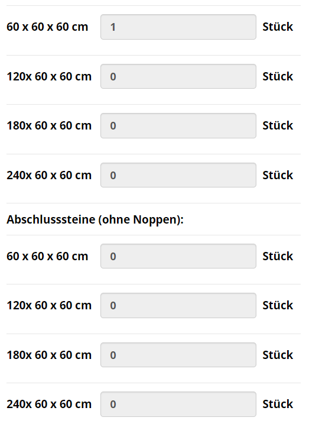

# Concrete Brick Configurator

Working demo: http://test.form-stil.com/wp-content/themes/betonstapelblock/onlineKonfi/?t=1683373799 (click "Konfiguration starten" bottom left button).

Click, next next and in this view:

You can see four different sizes. Both four with and without nipples (ohne Noppen) below. Now needed only three sizes for both: with and without nipples:

150 cm x 60 cm x 60 cm
90 cm x 60 cm x 60 cm
60 cm x 60 cm x 60 cm

No access due to company policy to the website. Make changes, commit and then they will upload and test.

These are the fbx files (@kaspar: not sure why needed):
https://www.dropbox.com/s/wkal5jzupsh1fsj/block_150x60x60.fbx.fbx?dl=0
https://www.dropbox.com/s/asnd0uwaura7ose/block_90x60x60.fbx.glb?dl=0
https://www.dropbox.com/s/48ysdgmmtjihn6o/block_1.afa7e744.fbx?dl=0